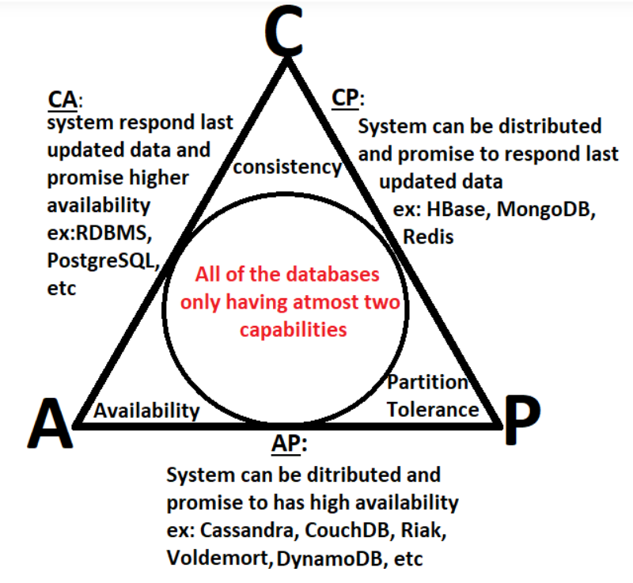

# Operating Systems

Operating System is the intermediary between hardware and software. It manages resources and i/o operations, hardware etc.
If there was no OS, there would be no UI, file system, error handling or resource management.

## Process
- A process in an instance of program in execution.
- Each process is allocated resources by OS
- A process control block (PCB) is used to track a process's execution status and holds information about the process. 
- A process table is an array of PCBs.
- A process table is used to keep track of live processes and resources allocated to each process
- A process can be in one of the following states - ready, running or waiting
- Only one process may be running at a time, only one process can be using the processor at a time

## The types of processes
- Zombie process - A process that has finished the execution but still has an entry in the process table to report to its parent process is known as a zombie process. A child process always first becomes a zombie before being removed from the process table. The parent process reads the exit status of the child process which reaps off the child process entry from the process table.
- Orphan process - Parent has terminated
- Daemon process - System related process that runs in the background for a very long time, has no controlling terminal

## Process Scheduling
- Arrival Time – Time at which the process arrives in the ready queue.
- Completion Time – Time at which process completes its execution.
- Burst Time – Time required by a process for CPU execution.
- Turn Around Time – Time Difference between completion time and arrival time. (Completion Time - Arrival Time)
- Waiting Time (WT) – Time Difference between turn around time and burst time. (Turn around time - burst time)


## Scheduling Algorithms
- First Come First Serve (FCFS)
- Shortest Job First (SJN)
- Priority
- Shortest Remaining Time (SRT)
- Round Robin Scheduling  
  
  - Round Robin scheduling prevents startvation
  - FCFS is non-preemptive

## Threads
- A thread is a lightweight process
- Threading us used for parallel processing, example - multiple tabs in a browser
- Threads are not independent of one another, they share resources, data and code
- Each thread has its own Program Counter (PC), register set and stack space
- Multithreading makes the software more responsive and increases throughput

## Thread vs Process vs Program
- Thread - ligthweight process, more efficient, segment of a process, shares memory with other threads
- Process -  Instance of a program in execution, processes are isolated from one another, active state, requires resources, has a PCB(Process control block), exists for a limited span of time
- Program - Set of instructions, passive state, static, only requires memory, no control block


## RAID
- RAID stands for redundant array of independent devices.
- RAID is a technique that makes use of a combination of multiple disks instead of using a single disk for increased performance, data redundancy, or both
- Essentially, multiple devices act as a single unit for better performance and data redundancy.
- RAID provides improved data reliability, performance, scalability, cost effective
- Disadvantanges include increased cost and complexity
- Each disk consists of multiple blocks
- Parity bit checking - Parity set to 0 if there are even number of 1 bits, else 1 (Total # of 1 bits will be even as result)
- There are 7 levels of RAID
    - RAID 0 -> Stripping
        - Blocks are stripped across disks. 
        - Instead on placing one block into a disk at a time, we can work with multiple disks
        - Data is distributed across the multiple units
        - No data replication and hence not reliable
        - Single failure could result in complete system failure
    - RAID 1 -> Mirroring
        - Every block has two copies on different disks
        - More reliable as there is a duplicate copy available
        - However, overall capacity of system reduces and is hence more expensive
    - RAID 2 -> Bit level stripping with dedicated parity
        - Error of data checked at every bit level using Hamming Code Parity method
        - One disk is reserved to store parity
        - If there were two disks, A would store the actual data while B stores the error code correction
        - Increased complexity
    - RAID 3 -> Byte level stripping with dedicated parity
        - Parity is checked at byte level 
        - In case of error, parity data can be used to reconstruct data
        - This method allows for data to accessed in parallel and in bulk
    - RAID 4 -> Block level stripping with dedicated parity
        - More reliable then previous levels. Allows recovery of at most 1 disk failure
    - RAID 5 -> Block level stripping with distributed parity
        - Modification of RAID 4 with the difference that there is no dedicated parity disk
        - Parity bits is distributed across disks (P1 in disk 1, P2 in disk 3 etc)
        - Improved randome write performance
    - RAID 6 -> Block level stripping with two parity bits
        - RAID 6 helps when more than one disk fails
        - Extra space is required
        - Uses two parity bits
        - Fast read transactions and high data accessibility
        - Slow write transactions

## Disk Access and Scheduling
- Seek Time: Seek time is the time taken to locate the disk arm to a specified track where the data is to be read or write.
- Rotational Latency: Rotational Latency is the time taken by the desired sector of disk to rotate into a position so that it can access the read/write heads.
- Transfer Time: Transfer time is the time to transfer the data. It depends on the rotating speed of the disk and number of bytes to be transferred. 
- Disk Access Time: Seek Time + Rotational Latency + Transfer Time 
- Disk Response Time: Response Time is the average of time spent by a request waiting to perform its I/O operation. Average Response time is the response time of the all requests.
- Disk Scheduling Algorithms include - 
    - First Come First Serve (FCFS)
    - Shortest Seek Time First (SSTF) 
        - Requests having shortest seek time are executed first. So, the seek time of every request is calculated in advance in a queue and then they are scheduled according to their calculated seek time. As a result, the request near the disk arm will get executed first.
    - SCAN (Elevator algorithm)
        - In SCAN algorithm the disk arm moves into a particular direction and services the requests coming in its path and after reaching the end of the disk, it reverses its direction and again services the request arriving in its path. So, this algorithm works like an elevator and hence also known as elevator algorithm.
    - CSCAN
        - In SCAN algorithm, the disk arm again scans the path that has been scanned, after reversing its direction. So, it may be possible that too many requests are waiting at the other end or there may be zero or few requests pending at the scanned area.
    - LOOK
        - It is similar to the SCAN disk scheduling algorithm except for the difference that the disk arm in spite of going to the end of the disk goes only to the last request to be serviced in front of the head and then reverses its direction from there only. Thus it prevents the extra delay which occurred due to unnecessary traversal to the end of the disk. 
    - CLOOK
        - As LOOK is similar to SCAN algorithm, in a similar way, CLOOK is similar to CSCAN disk scheduling algorithm. In CLOOK, the disk arm in spite of going to the end goes only to the last request to be serviced in front of the head and then from there goes to the other end’s last request. Thus, it also prevents the extra delay which occurred due to unnecessary traversal to the end of the disk.


## Cache
The cache is a smaller and faster memory that stores copies of the data from frequently used main memory locations. There are various different independent caches in a CPU, which store instructions and data. Cache memory is used to reduce the average time to access data from the Main memory. 

## Kernel
- A kernel manages operations of memory and CPU time
- It is a core component, all OS must have a kernel
- The kernel is loaded when the OS loads
- Kernels act as a brridge between applications and hardware level processing using system calls and inter-process communication

## Logical and Physical Address
- Logical Address is generated by the CPU and can be viewed by the user
- Physical Address is computed by the MMU and is the actual location of data in memory unit


## Fragmentation
Processes are stored and removed from memory, which makes free memory space, which is too little to even consider utilizing by different processes.  Suppose, that process is not ready to dispense to memory blocks since its little size and memory hinder consistently staying unused is called fragmentation. This kind of issue occurs during a dynamic memory allotment framework when free blocks are small, so it can’t satisfy any request.
- External Fragmentation - External fragmentation happens when there’s a sufficient quantity of area within the memory to satisfy the memory request of a method. However, the process’s memory request cannot be fulfilled because the memory offered is in a non-contiguous manner. 
- Iternal Fragmentation - Internal fragmentation happens when the memory is split into mounted-sized blocks. Whenever a method is requested for the memory, the mounted-sized block is allotted to the method. In the case where the memory allotted to the method is somewhat larger than the memory requested, then the difference between allotted and requested memory is called internal fragmentation. We fixed the sizes of the memory blocks, which has caused this issue. If we use dynamic partitioning to allot space to the process, this issue can be solved.  

| Internal Fragmentation | External Fragmentation |
| ------------------------------------------------------------------- | ------------------------------------------------------------------------ |
|In internal fragmentation fixed-sized memory, blocks square measure appointed to process. | In external fragmentation, variable-sized memory blocks square measure appointed to the method. | 
| Internal fragmentation happens when the method or process is smaller than the memory. | External fragmentation happens when the method or process is removed. | 
| The solution of internal fragmentation is the best-fit block.	| The solution to external fragmentation is compaction and paging. | 
| Internal fragmentation occurs when memory is divided into fixed-sized partitions. |	External fragmentation occurs when memory is divided into variable size partitions based on the size of processes. | 
| The difference between memory allocated and required space or memory is called Internal fragmentation.	 | The unused spaces formed between non-contiguous memory fragments are too small to serve a new process, which is called External fragmentation. | 
| Internal fragmentation occurs with paging and fixed partitioning. 	 | External fragmentation occurs with segmentation and dynamic partitioning.  | 
| It occurs on the allocation of a process to a partition greater than the process’s requirement. The leftover space causes degradation system performance.	| It occurs on the allocation of a process to a partition greater which is exactly the same memory space as it is required. |
| It occurs in worst fit memory allocation method. 	| It occurs in best fit and first fit memory allocation method. |

## Paging
The physical memory is divided into equal sized frames. The main memory is divided into fixed size pages. The size of a physical memory frame is equal to the size of a virtual memory frame. The secondary memory holds pages while the main memory holds frames. Paging is the process of fetching from secondary to main memory.

### Page Faults
A page fault is a type of interrupt, raised by the hardware when a running program accesses a memory page that is mapped into the virtual address space, but not loaded in physical memory.

### Page Replacement Algorithms
- First in, First out
- Optimal Page Replacement (Perfect but impossible)
- Least Recently Used

### Belady' Anomaly
With an increase in number of pages, the number of page faults will also increase

## Pipe
A Pipe is a technique used for inter-process communication. A pipe is a mechanism by which the output of one process is directed into the input of another process. Thus it provides a one-way flow of data between two related processes.
Inter-process communication (IPC) is a mechanism that allows processes to communicate with each other and synchronize their actions. The communication between these processes can be seen as a method of cooperation between them.

## Interrupts
The interrupts are a signal emitted by hardware or software when a process or an event needs immediate attention. It alerts the processor to a high-priority process requiring interruption of the current working process. In I/O devices one of the bus control lines is dedicated to this purpose and is called the Interrupt Service Routine (ISR).

## Direct Memory Access
- Allows i/o devices to interact directly with main memory
- Faster
- Managed by DMAC (direct mem add controller)

## Critical Section Problem
- Critical Section – The portion of the code in the program where shared variables are accessed and/or updated.
- Remainder Section – The remaining portion of the program excluding the Critical Section.
- Race around Condition – The final output of the code depends on the order in which the variables are accessed. This is termed as the race around condition.  
The solution for this problem must satisfy 3 conditions - mutual exclusion, bounded waiting and progress

## Synchronization Tools
Semaphores are just normal variables used to coordinate the activities of multiple processes in a computer system. They are used to enforce mutual exclusion, avoid race conditions and implement synchronization between processes. The process of using Semaphores provides two operations: wait (P) and signal (V). The wait operation decrements the value of the semaphore, and the signal operation increments the value of the semaphore. When the value of the semaphore is zero, any process that performs a wait operation will be blocked until another process performs a signal operation.   
  

A Semaphore is an integer variable that is accessed only through two atomic operations, wait () and signal (). An atomic operation is executed in a single CPU time slice without any pre-emption. Semaphores are of two types:
- Counting Semaphore
- Mutex (binary semaphore)

### Mutex
A mutex is a binary variable used to provide a locking mechanism. It offers mutual exclusion to a section of code that restricts only one thread to work on a code section at a given time.
```
int a;
mutex_lock  lock_a; //lock variable which should reside in shared memory
void thread()
{
    mutex_lock(&lock_a);
    //Some work in the thread
    &mutex_unlock(&lock_a);
}
```
### Counting Semaphore
They can have any integer value, which is not restricted to a specific range.
This semaphore can be used when we need to have two or more processes in the critical section simultaneously. It depends on the count variable of the semaphore that helps the task be acquired or released numerous times.
```
int count=n;			// number of processes we want to occur simultaneously
Wait (Semaphore S)  
{  
    count = count - 1;	//count value will get decreased when a new process enter  
    if (count< 0)  
    {    
        Sleep();		//the process will get into the blocked state. 
    }  
    else  
        return;  
}  


Signal (Semaphore s)  
{  
    count=count+1;		//count value will get increased when process is executed  
    if(count<=0)  
    {   
        Wake();			//if count>=0, then wake one of the processes in the blocked queue.                      
    }   
} 
```


## Deadlocks
- A situation where a set of processes are blocked because each process is holding a resource and waiting for another resource acquired by some other process. Deadlock can arise if following four conditions hold simultaneously (Necessary Conditions):
    - Non-preemptive
    - Mutual Exclusion
    - Hold and wait
    - Circular wait
- Methods to handle deadlock 
    - Deadlock prevention or avoidance - The idea is to not let the system into deadlock state.
    - Deadlock detection and recovery - Let deadlock occur, then do preemption to handle it once occurred.
    - Ignore the problem all together - If deadlock is very rare, then let it happen and reboot the system. This is the approach that both Windows and UNIX take.
- Safe state - The set of dispatchable processes is in a safe state if there exists at least one temporal order in which all processes can be run to completion without resulting in a deadlock.

## Banker's Algorithm
- Algorithm for resource allocation to avoid deadlocks
- This algorithm handles multiple instances of the same resource. It allows the memory to be shared among multiple processes.

## Synchronization Problems
- Bounded buffer
- Readers - writers
- Dining Philosophers
- Sleeping barber

## Some Important Terms
- Thrashing - Thrashing occurs when more time is spent processing page faults than executing transactions. It results in decreased computer performance.
- Buffer - A buffer is the memory area that stores data being transferred between any two devices or applications
- Bootstrapping - Process of loading set of instructions when PC is booted, initializes OS
- Dynamic Loading - Load when called, useful for errir routines
- Overlays - Load and use only what is needed, ie. load part of program, use it then unload
- Multitasking - More than one task is executed at the same time.
- Spooling - Putting jobs on buffer where a device may access them when ready
- Assembler - converts assembly code to machine code
- Starving - If a process does not get resources forever (possibly due to low priority)
- Aging - add age factor to priority
- Short term Scheduler - Choose from ready queue and schedule for execution
- Medium term Scheduler -  Swap process from memory post execution
- Long term scheduler - from secondary memory to ready queue
- Race Condition- When two or more processes try to access the same shared variable, there is a possibility that it may produce an incorrect output which depends on the order in which access takes place.
 