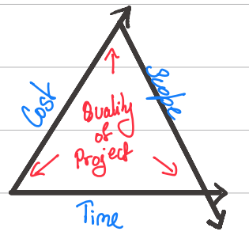
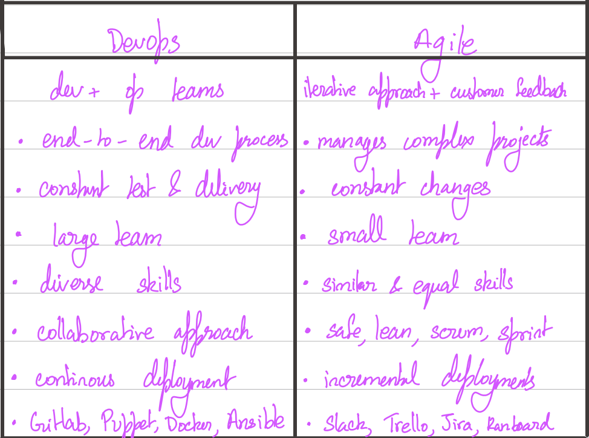

# Software Engineering

A Software system consists of a numbr of seperate programs, configuration files which are used to set ip these programs, system documentation which describes structure of system and user documentation which explains how to use the system and website to download recent product information

A software product is developed and maintained for the the benefit of the user to satsify a market need.

Engineering is the application of science and math to solve problems.

Software engineering is the systematic approach to analyse, design, assess, implement, test, maintain and re-engineer software.
SE Principle - use of appropriate tools and techniques to solve problems while considering constraints and resources available.
Software Process - A set of activities and associated outcomes. Each activity has defined entry and exit criterias, dependency, tasks and deliverables, constraints and persons resposible to carry out the task

## Types of Software
- System software: Softwares like operating systems, compilers, drivers, etc. fall into this category.
- Application software - MS Word, Excel, etc
- Networking and web development software: Computer networking software offers the necessary functionality for computers to communicate with one another and with data storage facilities.
- Embedded Software: Software used in instrumentation and control applications such as washing machines, satellites, microwaves, TVs, etc.
- Artificial Intelligence Software: Expert systems, decision support systems, pattern recognition software, artificial neural networks, and other types of software are included in this category.
- Scientific software: These support a scientific or engineering user's requirements for performing enterprise-specific tasks. Examples include MATLAB, AUTOCAD, etc

## Characteristics of SW
FLURPS - Functionality, localizability, usability, reliability, performance and security
- Functionality: The things that software is intended to do are called functionality. For example, a calculator's functionality is to perform mathematical operations.
- Efficiency: It is the ability of the software to use the provided resources in the best way possible. Increasing the efficiency of software increases resource utilization and reduces cost.
- Reliability: Reliability is the probability of failure-free operational software in an environment. It is an important characteristic of software.
- Usability: It refers to the user’s experience while using the software. Usability determines the satisfaction of the user.
- Maintainability: The ease with which you can repair, improve, and comprehend software code is referred to as maintainability. After the customer receives the product, a phase in the software development cycle called software maintenance begins.
- Portability: It refers to the ease with which the software product can be transferred from one environment to another.

The quality of the project is defined by the cost, time and scope. 

- Product Development Lifecycle (PDLC)
    - Brainstoem
    - Define
    - Design
    - Test
    - Launch

- Project Management Lifecycle (PMLC)
    - Feasibility Analysis
    - Requirements Engineering
    - Architecture and Design
    - Implementation
    - Testing
    - Maintenance

- Software Management LifeCycle
    - Problem identification
    - Analysis
    - Approval for change
    - Design
    - Implement
    - Unit testing
    - System and acceptance testing
    - Delivery in the form of patches or release

- Software Design Life Cycle
    - Requirement Analysis
    - Design
    - Implement
    - Test and Integration
    - Deployment
    - Maintenance

## Types of Models
- Waterfall Model
    - Pros - simple, clear phases, easy to manage, easy to control
    - Cons - Frozen requirements, difficult to change, Sequential, high risk and uncertainty, not for long projects
- V Model
    - Pros - Test before formal test cycle, efficient with higher success rate
    - Cons - similar to waterfall model, change in process results in change in test docs
- Prototype
    - Cheap, evolutionary and throwaway prototypes
    - Pros - Involves users (for feedback/evaluation), risk mitigation, reduces time and cost, stable
    - Cons - Increases complexity, not optimal
- Incremental
    - Each subsequent release adds functionality
    - Pros - added customer value, more flexible, easier to test and debug, manages risk, reduces over functionality
    - Cons - Needs good planning and design, higher cost, reduced visibility
- Iterative
    - Rapid prototyping and successive refinement
    - Pros - help identify requirements and solution visualization, incremental investment, risk mitigation
    - Cons - Rigid phases with overlap, may result in high system architecture costs
    

## Agile
The Agile methodology is a project management approach that involves breaking the project into phases and emphasizes continuous collaboration, improvement and feedback. Teams follow a cycle of planning, executing, and evaluating.
- Continual realignment of goals
- Reduce planning overhead and facilitate change
- Rapid, Iterative, Cooperative, Quality Driven, Adaptable
- Customer involvement, incremental delivery, embrace change and simplicity
- Cons - minimum documentation, risk of sustainability, extensibility and maintainability, team transfer, ot suitable for projects with complex dependencies

- Agile Manifesto - Individuals and interactions over process and tools, working software over comprehensive documentation Collaboration over negotiation, respond to change over sticking to original plan

## SCRUM 
Scrum is an agile project management system commonly used in software development and other industries. Scrum prescribes for teams to break work into goals to be completed within time-boxed iterations, called sprints. Each sprint is usually 4 weeks. SCRUM is a framework while Agile is a philosophy.
- It is a framework of rules, roles, events and artifacts
- Iterative
- Delivers a version regularly
- Roles - Product owner, scrum master and team
- Artifacts include product and sprint backlog, sprint and release burndown charts

## Extreme Programming (Agile-XP)
- Allow small to mid-sized teams to produce high-quality software and adapt to evolving and changing requirements
- Incremental changes, embrace change, assumed simplicity, rapid feedback and quality work
- Iteration Planning
- Test Driven development, refactoring, pair programming, collective code ownership, continuous integration, small releases

## Lean Agile
- Minimize waste, maximize output
- Optimize the whole, decide as late as possible, deliver as fast as possible

## Requirements Engineering
- Clear, concise, consistent, feasible, verification, quantifiable, traceable
- Feasibility Study - To assess practicality
- Validation - Right requirements are realized (Does it solve the right problem)
- Verification - Are the requirements specified correctly
- Software Requirement Specification(SRS) - Documentation of set of requirements

## Architecture
The architecture of a software defines how the software is decomposed and organized into components. Software architecture is a top-level decomposition into major components, it provides a blueprint. Decomposition can be done on the basis of functionality, generality, using top-down or bottom-up approaches, divide and conquer or by stepwise refinement.

In this phase, functionality and quality goals are balances, constraints are drawn and considered and the structure of the project is defined.

An architectural pattern is a general reusable solution to a commonly occurring problem.

### Service Oriented Architecture
- Reuse components from pre-existing applications
- Loose coupling
- Software components are made reusable through service interfaces
- SOAP/HTTP or HSON/HTTP protocols

### Microservices Architecture
- 

## Coding Guidelines
- Good documentation, indentation, minimal length of functions, avoid jump statements, appropriate comments, appropriate variable names, avoid same identifier name

## Software Configuration Management (SCM)
- manages changes introduced to product
-  framework for maintenance and support
- Track changes, version control, defect tracking
- Manage source code, build, installation and bug tracking
- Tools include - Git, Make, Maven, Bugzilla

### Version Control System
- traceable changes, revertions, conflict resolution, code maintenance
- Release - Formal Distribution
- Revision - Fix errors
- Version - Re-release of config. item
- Git, BitBucket

### Build Management
- Create an application program for a software release by compiling and linking source code and libraries to build artifacts such as executables
- Apache ant, Make, Maven

## Software Testing
Examine functionality and behaviour
- Error -  Mistake in code
- Bug - result of error
- Defect - deviation from req.
- Failure - inability to perform a req.
- Fault - Anomaly is software
- Issue - raised by end user
- Verification -> Static testing, checking documentation, find bugs
- Validation - Dynamic testing, project scope, white box, black box, functional testing

## DevOps
- Continous Integration, delivery, testing and deployment. 
- DevOps is a set of practices, tools, and a cultural philosophy that automate and integrate the processes between software development and IT teams. 
- It emphasizes team empowerment, cross-team communication and collaboration, and technology automation. Continous planning, building, testing, deploying and feedback.
- Deliver functionality incrementally and at a faster rate
- DevOps Pipeline - Set of automated processes and tools to allow developers to work cohesively to build and deploy
- Tools include - Github, Docker, Jenkins

## Some Terms
- WBS - Work Breakdown Schedule
- CoCoMo - Constructive Cost Model
    - based on lines of code, effort and schedule as parameters
- Brooke's Law -  Adding people later increases cost and time
- Gantt Chart - Chart that shows activities against time (what should be done and when)
- JIRA - a project management tool with features to track bugs and issues
- Capability Maturity Model (CMM) - assess capability of vendor to deliver (Initial, repeatable, defined, optimized)
- Framework - A framework is a well-known method of developing and deploying software. It is a set of tools that allows developing software by providing information on how to make it on an abstract level, rather than giving exact details. 
- Debugging - Debugging is the process of finding a software bug, in the context of software engineering. To put it another way, it refers to the process of finding, evaluating, and correcting problems. 
- Scope - The scope of a software project is a well-defined boundary that incorporates all the activities involved in developing and delivering a software product.
- POC - Proof of Concept
- MVP - Minimum Viable Product
- Software Re-engineering - The process of updating software is known as software reengineering. This procedure entails adding new features and functionalities to the software in order to make it better and more efficient.
- Modularization - Modularization is ‌breaking down a program's functionality into separate, independent modules, each of which includes just the information needed to carry out one part of the intended capability. In simple terms, it is the practice of dividing the program into smaller modules so that we can deal with them separately. We can simply add independent and smaller modules to a program using modularization without being hampered by the complexity of the program's other functionalities. 